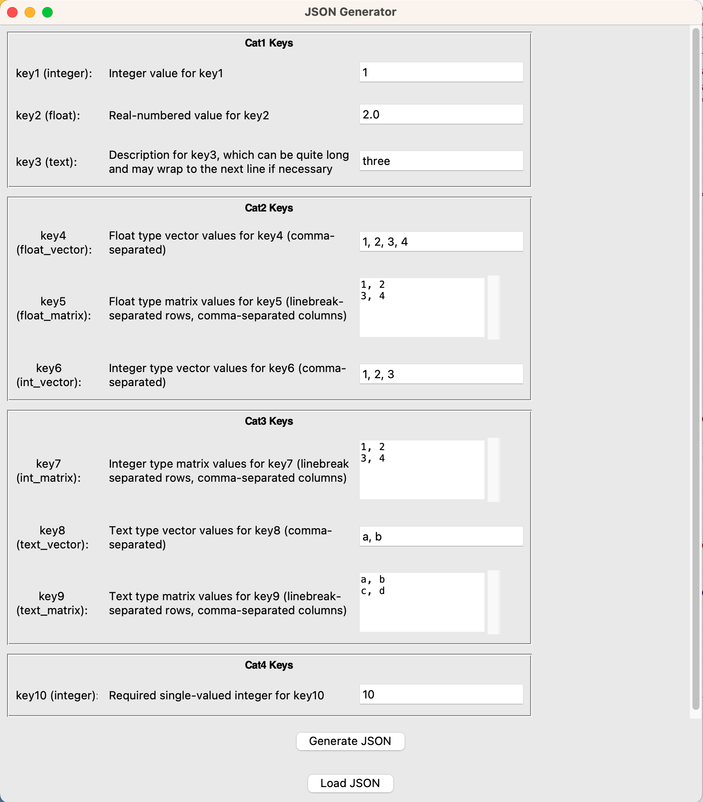

# json_gen_gui
GUI to generate and load a JSON file with predefined keys
# Description

## 99.9% of this python script was generated by ChatGPT 3.5
## Simple GUI 
- Very simple GUI to generate a JSON file with predefined keys.
- Load a JSON file compatible with the predefined keys.
- The keys can be distinguished by "category".
- Customize categories, keys, and descriptions on your demands by editing `json_gen_v0.py`.
- Not good for handling vectors or matrices of mixed data types.
- Mouse wheel scrolling is not available. Please just use arrows, pgdn, and pgup, or click and drag the scroll bar.
## Available data types
- Single valued integer, float, and text
- Vector of integer, float, and text (no mixed type allowed)
- Matrix of integer, float, and text (no mixed type allowed)

## My own purpose
- I intended to create a simple GUI to generate input files of my simulation codes, containing many parameters.
- Also wanted to edit the values of existing input files through this simple GUI. 
